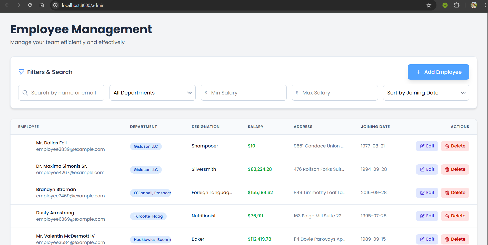

# Employee Management System

## Table of Contents

1. [Overview](#overview)
2. [Architecture](#architecture)
3. [Database Design](#database-design)
    - [Migrations](#migrations)
    - [Models](#models)
4. [Bulk Data Insertion](#bulk-data-insertion)
5. [API Documentation](#api-documentation)
    - [Authentication & Security](#authentication--security)
    - [Employee CRUD Endpoints](#employee-crud-endpoints)
    - [API Notation for Swagger](#api-notation-for-swagger)
6. [Admin Dashboard (Vue.js)](#admin-dashboard-vuejs)
    - [Features](#features)
    - [UI/UX](#uiux)
    - [Security](#security)
    - [How to Access the Admin Dashboard](#how-to-access-the-admin-dashboard)
7. [Performance Optimization](#performance-optimization)
8. [Project Structure](#project-structure)
9. [Setup & Installation](#setup--installation)
10. [Testing](#testing)
11. [Best Practices & Conventions](#best-practices--conventions)
12. [Appendix](#appendix)

---

## Overview

The Employee Management System is a robust, scalable web application built with Laravel (backend) and Vue.js (frontend). It provides full CRUD operations for employee management, supports bulk data operations, and is optimized for high performance and security.

---

This is a snapshot of the admin dashboard.



## Architecture

-   **Backend:** Laravel (PHP)
-   **Frontend:** Vue.js (Single File Components)
-   **Database:** MySQL (or compatible)
-   **API:** RESTful, stateless, secured with Laravel Sanctum
-   **ORM:** Eloquent

---

## Database Design

### Migrations

#### 1. `departments` Table

| Field       | Type      | Attributes         |
| ----------- | --------- | ------------------ |
| id          | int       | Primary, Auto Inc. |
| name        | string    |                    |
| description | string    |                    |
| created_at  | timestamp |                    |
| updated_at  | timestamp |                    |
| deleted_at  | timestamp | Soft Deletes       |

#### 2. `employees` Table

| Field         | Type      | Attributes   |
| ------------- | --------- | ------------ |
| id            | uuid      | Primary      |
| name          | string    |              |
| email         | string    | Unique       |
| department_id | int       | Foreign Key  |
| created_at    | timestamp |              |
| updated_at    | timestamp |              |
| deleted_at    | timestamp | Soft Deletes |

#### 3. `employee_details` Table

| Field       | Type      | Attributes         |
| ----------- | --------- | ------------------ |
| id          | int       | Primary, Auto Inc. |
| employee_id | uuid      | Foreign Key        |
| designation | string    |                    |
| salary      | float     |                    |
| address     | string    |                    |
| joined_date | date      |                    |
| created_at  | timestamp |                    |
| updated_at  | timestamp |                    |

**Note:** All migrations are located in `database/migrations/` and follow Laravel conventions.

### Models

-   `Department` (`app/Models/Department.php`)
-   `Employee` (`app/Models/Employee.php`)
-   `EmployeeDetail` (`app/Models/EmployeeDetail.php`)

Each model uses Eloquent ORM, defines relationships, and leverages soft deletes where appropriate.

---

## Bulk Data Insertion

-   **Factories:** Located in `database/factories/`
    -   `DepartmentFactory.php`
    -   `EmployeeFactory.php`
    -   `EmployeeDetailFactory.php`
-   **Seeder:** `DatabaseSeeder.php` orchestrates the creation of 10 departments and 100,000 employees with associated details.
-   **Best Practices:** Uses chunked inserts and disables event listeners during seeding for performance.

---

## API Documentation

### Authentication & Security

-   **Authentication:** Laravel Sanctum for API token authentication.
-   **Middleware:** All API routes are protected by authentication middleware.
-   **Validation:** All requests are validated using Form Request classes (`StoreEmployeeRequest`, `UpdateEmployeeRequest`).
-   **Rate Limiting:** Configurable via Laravel’s built-in throttling.

### Employee CRUD Endpoints

| Method | Endpoint              | Description                | Auth | Body/Params       |
| ------ | --------------------- | -------------------------- | ---- | ----------------- |
| GET    | `/api/employees`      | List employees (paginated) | Yes  | `page`, `filters` |
| GET    | `/api/employees/{id}` | Get employee details       | Yes  |                   |
| POST   | `/api/employees`      | Create new employee        | Yes  | Employee payload  |
| PUT    | `/api/employees/{id}` | Update employee            | Yes  | Employee payload  |
| DELETE | `/api/employees/{id}` | Soft delete employee       | Yes  |                   |

#### Filtering, Sorting, and Pagination

-   **Filter by Department:** `?department_id=`
-   **Filter by Salary Range:** `?salary_min=&salary_max=`
-   **Sort by Joining Date:** `?sort=joining_date_asc|desc`
-   **Search by Name/Email:** `?search=`

### API Notation for Swagger

-   All endpoints are annotated with PHPDoc-style comments for easy Swagger/OpenAPI generation.
-   Example:
    ```php
    /**
     * @OA\Get(
     *   path="/api/employees",
     *   summary="List employees",
     *   @OA\Parameter(...),
     *   @OA\Response(...)
     * )
     */
    ```

---

## Admin Dashboard (Vue.js)

### Features

-   **Employee Listing:** Paginated, sortable, and filterable table.
-   **CRUD Operations:** Create, edit, and delete employees via modals/forms.
-   **Search & Filter:** By name, email, department, salary range, and joining date.
-   **Pagination:** Server-side, efficient for large datasets.
-   **Icons:** Edit & delete actions in each row.

### UI/UX

-   **Component:** `resources/js/components/AdminDashboard.vue`
-   **Design:** Clean, responsive, and user-friendly.
-   **State Management:** Uses Vue’s reactive data and emits for parent-child communication.

### Security

-   **API Calls:** All requests include authentication tokens.
-   **Input Validation:** Both client-side and server-side.

### How to Access the Admin Dashboard

1. Start the Laravel backend server:
    ```bash
    php artisan serve
    ```
2. Ensure you have built the frontend assets:
    ```bash
    npm install
    npm run build
    ```
3. Visit the admin dashboard in your browser at:

    - [http://localhost:8000/admin](http://localhost:8000/admin)

    (The dashboard view is rendered by `resources/views/admin.blade.php` and loads the Vue.js component.)

---

## Performance Optimization

-   **Database Indexing:** Indexes on foreign keys and frequently queried fields.
-   **Eager Loading:** Reduces N+1 query issues in Eloquent.
-   **Chunked Processing:** For bulk inserts and updates.
-   **Caching:** Configurable via Laravel’s cache system.
-   **Pagination:** All list endpoints are paginated.
-   **Queueing:** For heavy/long-running tasks (optional, via Laravel queues).

---

## Project Structure

```
employee-management/
  app/
    Http/Controllers/Api/EmployeeController.php
    Models/Employee.php, Department.php, EmployeeDetail.php
    Http/Requests/StoreEmployeeRequest.php, UpdateEmployeeRequest.php
  database/
    migrations/
    factories/
    seeders/
  resources/
    js/components/AdminDashboard.vue
    views/admin.blade.php
  routes/api.php
  ...
```

---

## Setup & Installation

1. **Clone the repository**
2. **Install dependencies**
    - Backend: `composer install`
    - Frontend: `npm install`
3. **Environment setup**
    - Copy `.env.example` to `.env` and configure DB credentials
4. **Generate application key**
    - `php artisan key:generate`
5. **Run migrations and seeders**
    - `php artisan migrate --seed`
6. **Build frontend assets**
    - `npm run build`
7. **Serve the application**
    - Backend: `php artisan serve`
    - Frontend: Served via Laravel or separate dev server

---

## Testing

-   **Feature Tests:** Located in `tests/Feature/EmployeeApiTest.php`
-   **Unit Tests:** Located in `tests/Unit/`
-   **Run tests:** `php artisan test`

---

## Best Practices & Conventions

-   **Code Style:** PSR-12 for PHP, ESLint/Prettier for JS.
-   **Validation:** All input validated via Form Requests.
-   **Error Handling:** Consistent API error responses.
-   **Documentation:** Inline PHPDoc and JSdoc comments.
-   **Security:** Follows Laravel and Vue.js security best practices.

---

## Appendix

-   **Extending:** Add more fields or relationships by updating migrations, models, and Vue components.
-   **Swagger/OpenAPI:** Use annotations for auto-generation.
-   **Scaling:** Use Laravel Horizon, Redis, and database optimization for high concurrency.

---

**This documentation provides a high-level overview and should be supplemented with code-level exploration for implementation specifics.**
